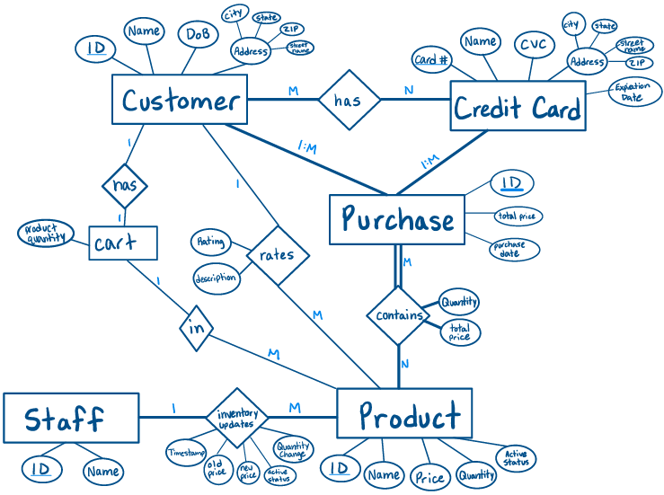

# E-Commerce Project

A command-line shopping system for that supports customers, staff, products, carts, checkout, purchases, and credit card management.

## Project Management Information

| Item | URL |
|---|---|
| GitHub Projects board | https://github.com/users/BrianN45/projects/4 |
| Source code repository | https://github.com/BrianN45/CS4092-Final-Project |
| Contributors | Brian Nguyen and Morgan Schirmer |

## Install Dependencies

Run the following command to install required libraries:

```bash
pip install -r requirements.txt
```

## Run the Application

From the project root directory, start the CLI with:

```bash
python src/main.py
```

Then use the available commands to browse products, add items to the cart, checkout, and view purchase history.

## Available Commands

- `change <customer/staff>`: Change the current role between customer and staff.
- `add_product`: Add a new product (staff only).
- `edit_product <product id>`: Edit product price, quantity, or active status (staff only).
- `view_products [product id]`: List all products or a specific product.
- `add_card`: Add a new credit card.
- `edit_card <card number>`: Edit a credit card's details.
- `view_cards [credit card number]`: View credit cards available to the current user or a specific card.
- `buy_product <product id> <quantity>`: Add a product to the customer's cart.
- `view_cart`: Show the products currently in the customer's cart.
- `checkout <credit card number>`: Complete the purchase for all items in the cart.
- `view_purchases`: Display the current customer's purchase history.
- `rate_product <product id>`: Rate a product (customer only).
- `view_product_rating <product id>`: View ratings for a product.

## ER Diagram

